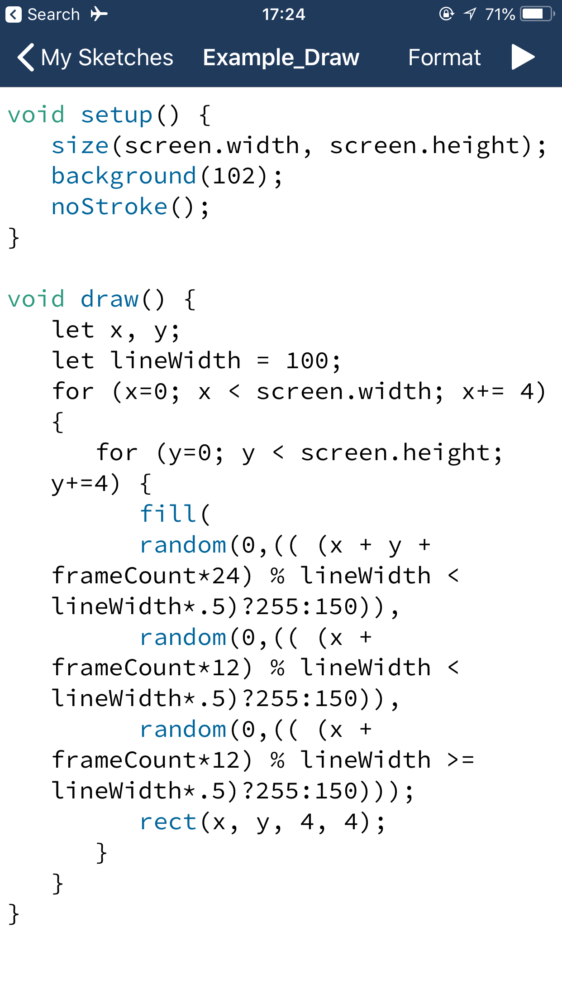
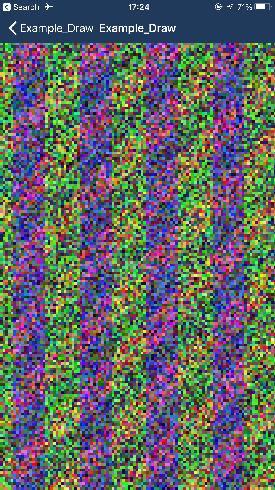
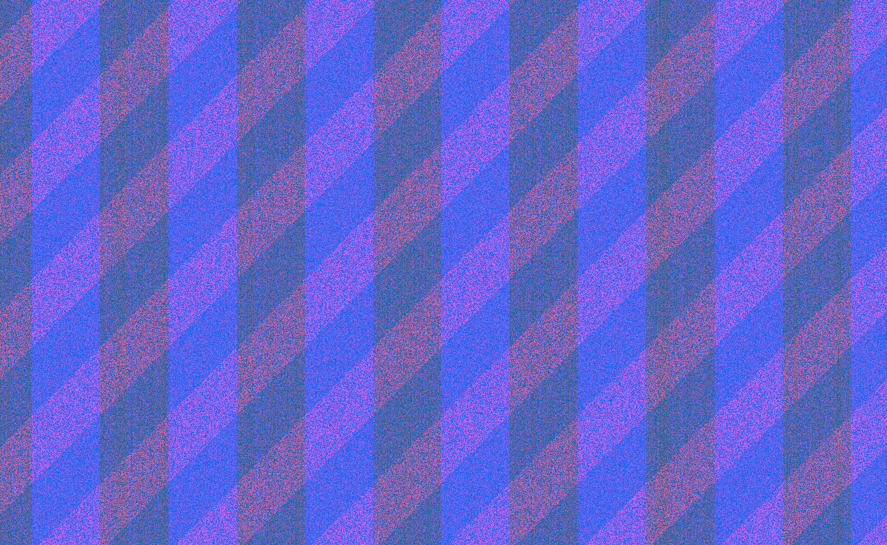
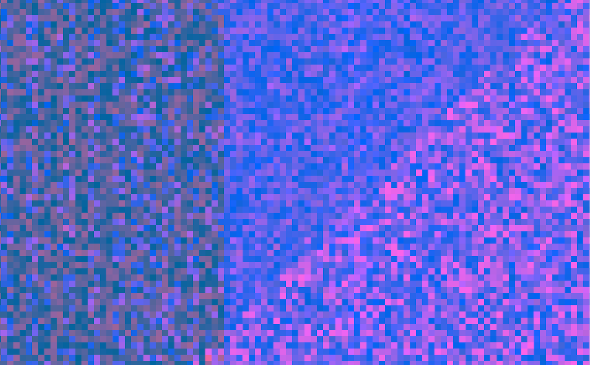

# Pixel9

This is my ninth experiment with Processing.  Pixel9 links via UDP to receive messages from it's Max 7 patch sibling!
## Goal
Pixels are an incredible medium!  Mass market 4K displays and projectors allow digital artists to work with a canvas that's 4x larger than 1080p HD and 27x larger than 480p SD.  There are 8,294,400 pixels in a 4K display, that's a massive!  This program aims to reveal each pixel to the viewer.  A high end graphics card is required to run this program, it pushes the limits of my NVIDIA 1070.  
## Idea
This is my first version of the sketch.  I wrote it with the Processing iPhone app.  The idea was to create color banding that would move across the screen with semi-random variations within the bands.  I'm using 4 pixel wide rectangles because my iPhone's gpu unsurprisingly can't refresh it's 1080p screen fast enough for the program to look satisfyingly smooth.  
```javascript
void setup() {
   size(screen.width, screen.height);
   background(102);
   noStroke();
}

void draw() {
   let x, y;
   let lineWidth = 100;
   for (x=0; x < screen.width; x+= 4) {
      for (y=0; y < screen.height; y+=4) {
         fill(
         random(0,(( (x + y + frameCount*24) % lineWidth < lineWidth*.5)?255:150)), 
         random(0,(( (x + frameCount*12) % lineWidth < lineWidth*.5)?255:150)), 
         random(0,(( (x + frameCount*12) % lineWidth >= lineWidth*.5)?255:150)));
         rect(x, y, 4, 4);
      }
   }
}
```   


## 
## Credits
This youtube video shows how to setup UDP between Processing and Max 7:
[https://www.youtube.com/watch?v=FCazZMdSHtk&t=696s](https://www.youtube.com/watch?v=FCazZMdSHtk&t=696s)


